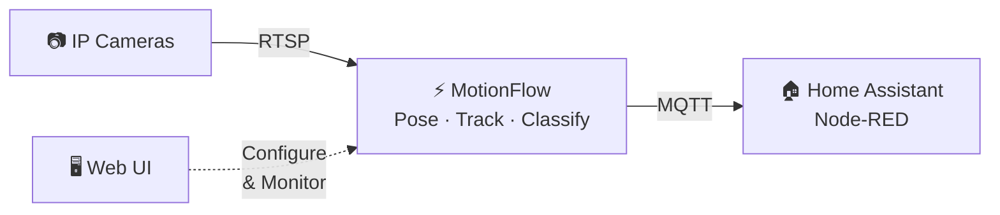
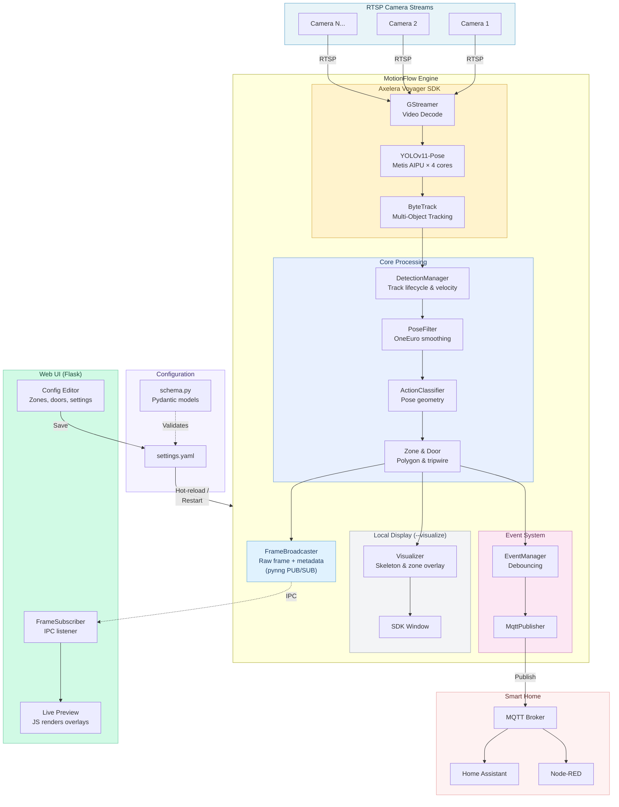
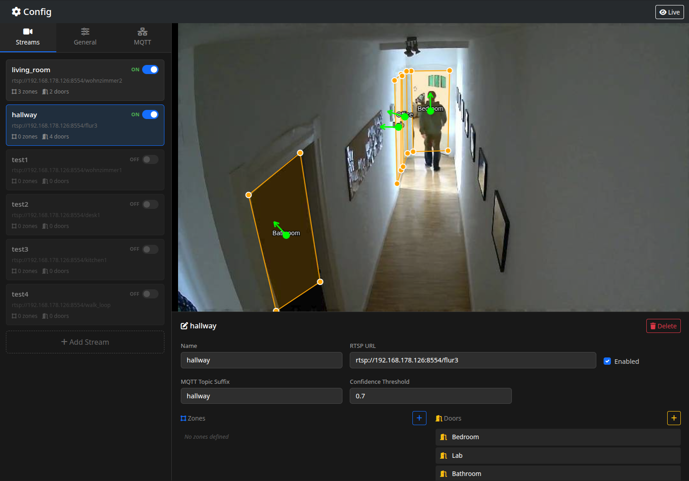
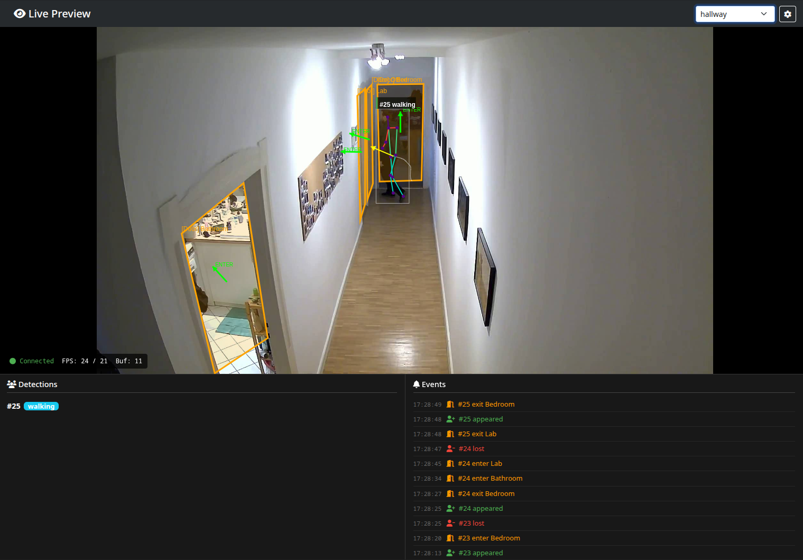

# MotionFlow

**AI-powered activity sensing for smart homes** – transforms ordinary IP cameras into privacy-preserving presence and activity sensors, running entirely on local edge hardware.

MotionFlow uses real-time pose estimation on an **Orange Pi 5 Plus** with the **Axelera Metis** AI accelerator to detect *what people are doing* (standing, sitting, lying, walking) and *where* (user-defined zones), then publishes state changes via **MQTT** for integration with Home Assistant, Node-RED, or any automation platform.

---

## 🎯 Overview



**Why?** Commercial smart home sensors tell you *someone is there*. MotionFlow tells you *who is doing what, where* — "person on the couch, sitting" vs "person at the front door, walking in" — using cameras you already have, processed entirely on-device with no cloud dependency.

---

## ✨ Features

- **Multi-camera processing** – Handles multiple RTSP streams in a single pipeline
- **Activity classification** – Recognizes standing, sitting, lying, walking, phone use, reading from pose geometry
- **Zones & doors** – Define polygon zones and tripwire doors; get occupancy counts and directional enter/exit events
- **MQTT integration** – Debounced state-change events for Home Assistant / Node-RED
- **Web UI** – Configure zones and doors visually; live preview shows the annotated inference stream
- **Hardware-accelerated** – Runs YOLOv11-Pose on Axelera Metis AIPU with HW video decoding
- **Fully local** – No cloud, no data leaves your network


---

## 📋 Prerequisites

**Hardware** – Orange Pi 5 Plus with an Axelera Metis M.2 AI accelerator, plus one or more RTSP-capable IP cameras.

**OS** – Ubuntu 24.04 for the RK3588, using [Joshua Riek's ubuntu-rockchip](https://github.com/Joshua-Riek/ubuntu-rockchip/) images.

**Software:**
- **Axelera Voyager SDK** – installed on the target (provides GStreamer pipeline, AIPU runtime, tracking)
- **Python 3.10+** (included in the SDK venv)
- **MQTT broker** – e.g. Mosquitto, for Home Assistant / Node-RED integration
- Python dependencies: see `requirements.txt`

---

## 🚀 Quick Start

### 1. Install dependencies

MotionFlow runs inside the **Axelera Voyager SDK venv** on the target device:

```bash
# Activate the SDK venv
source ~/voyager-sdk/venv/bin/activate

# Install MotionFlow's dependencies into it
pip install -r requirements.txt
```

### 2. Configure

Edit `config/settings.yaml` directly, or use the Web UI at `http://<device-ip>:5000`:
- Add RTSP stream URLs for your cameras
- Draw **zones** (polygons) and **doors** (tripwires) on the live video
- Set MQTT broker address and topic prefix
- Hit **Save** – zones and settings hot-reload instantly

### 3. Run

```bash
source ~/voyager-sdk/venv/bin/activate

# Start the engine
python main.py --config config/settings.yaml

# Start the web UI (separate terminal)
python web_ui/app.py --config config/settings.yaml --port 5000
```

Or use the provided **systemd services** for production:

```bash
./systemd/install.sh
sudo systemctl start motionflow motionflow-webui

# View logs
journalctl -u motionflow -u motionflow-webui -f
```

### 4. Integrate

Subscribe to MQTT topics in Home Assistant or Node-RED:

```
motionflow/{stream_name}/{zone_name}
```

---

## 🏗️ Architecture



---

## 🖥️ Web UI

The Flask-based Web UI (`http://<device-ip>:5000`) provides two views:

### Config Editor
Draw zones and doors directly on the camera feed. Changes are hot-reloaded into the running engine on apply.



### Live Preview
Shows the annotated inference stream in real-time, with detection and event feeds below.



---

## 📡 MQTT Events

**Topic pattern:**
```
motionflow/{stream_name}/{zone_name}
```

**Example payload:**
```json
{
  "event": "zone_enter",
  "timestamp": 1738857600.123,
  "stream": "living_room",
  "zone": "Couch1",
  "person": {
    "id": 3,
    "action": "sitting"
  },
  "occupancy": 1
}
```

**Event types:** `zone_enter` · `zone_exit` · `door_enter` · `door_exit` · `action_change` · `track_new` · `track_lost`

---

## ⚙️ Configuration

Configuration lives in `config/settings.yaml`, validated by Pydantic models in `config/schema.py`.

| Section | What it controls |
|---------|-----------------|
| `general` | Pipeline model, FPS limits |
| `mqtt` | Broker address, topic prefix, QoS, credentials |
| `streams[]` | Per-camera RTSP URL, zones, doors, debounce timings, action filters |

**Hot-reload vs restart:**
- Zones, doors, debounce, display settings → **hot-reloaded** (no downtime)
- Stream URLs, enabled/disabled, pipeline model → **automatic restart** via IPC

---

## 📁 Project Structure

```
MotionFlow/
├── main.py                  # Entry point
├── config/
│   ├── schema.py            # Pydantic models (AppConfig, StreamConfig, Zone, Door)
│   └── settings.yaml        # Runtime configuration
├── core/
│   ├── engine.py            # AxeleraMultiStreamProcessor – SDK integration
│   ├── models.py            # Domain models (Detection, Zone, Door, DetectionManager)
│   ├── actions.py           # Rule-based action classifier
│   ├── events.py            # EventManager, EventListener, MotionEvent
│   ├── filters.py           # PoseFilter (OneEuro wrapper)
│   ├── mqtt.py              # MQTT publisher
│   ├── visualization.py     # Skeleton / zone / action overlay
│   └── frame_broadcaster.py # IPC frame publisher (pynng PUB/SUB + REQ/REP)
├── web_ui/
│   ├── app.py               # Flask app (config editor + live preview)
│   ├── templates/           # HTML templates
│   └── static/              # CSS, JS
├── systemd/                 # Production systemd service files + installer
└── tests/                   # pytest unit & integration tests
```

---

## 🛠️ Development

```bash
# Run tests
pytest tests/
```

**Dependencies** are installed into the SDK venv (see Quick Start).
